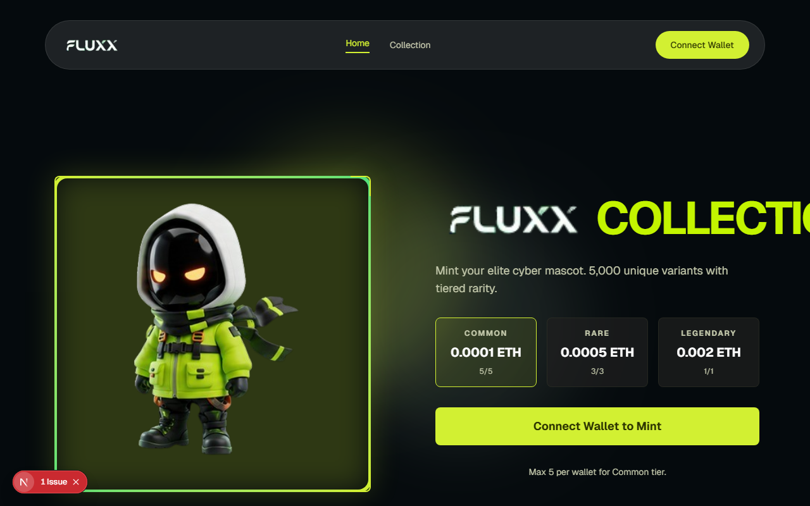
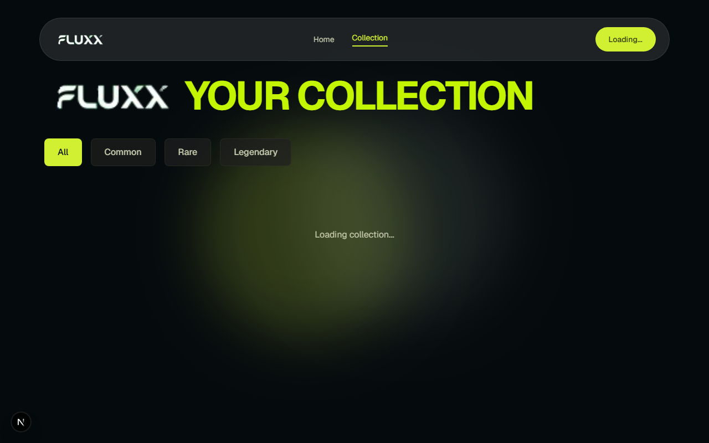

# FLUXX NFT Collection

A full-stack NFT minting dApp with tiered rarity system, responsive design, and Etherscan/MetaMask-compatible metadata.

## Project Overview

FLUXX NFT Collection is a production-ready NFT minting platform featuring:

- **Tiered Rarity System**: Common, Rare, and Legendary NFTs with different prices and wallet limits
- **On-Chain Metadata**: Base64-encoded metadata for Etherscan and MetaMask compatibility
- **IPFS Integration**: Images hosted on Pinata with individual IPFS CIDs
- **Responsive Design**: Mobile, tablet, and desktop optimized UI
- **Wallet Integration**: Wagmi for seamless MetaMask connection
- **Error Handling**: User-friendly alert notifications for all operations

## 🚀 Live Deployment

**Visit the live application:** [FLUXX NFT Marketplace](https://frontend-dwhkbx7en-olaaniis-projects.vercel.app)

- **Status:** ✅ Live on Vercel
- **Network:** Sepolia Testnet
- **Features:** Mint NFTs, Browse Marketplace, Trade NFTs, Manage Collection

## Tech Stack

### Smart Contract

- Solidity `^0.8.24`
- Hardhat
- OpenZeppelin Contracts (`ERC721`, `Ownable`, `Pausable`, `ReentrancyGuard`)
- Base64-encoded on-chain metadata

### Frontend

- Next.js 13+ (App Router)
- React 18+
- Wagmi for wallet connection
- Tanstack Query for data fetching
- TailwindCSS for styling
- TypeScript

## Frontend Preview

### Minting Interface



### User Collection Page



## Contract Addresses (Sepolia)

### NFT Minting Contract

**Address:** `0x640420bbBfb81Cd6B05058f0d8C57179CD03a7bC`

- **Etherscan:** [View Contract](https://sepolia.etherscan.io/address/0x640420bbBfb81Cd6B05058f0d8C57179CD03a7bC#code)
- **Network:** Sepolia Testnet
- **Status:** ✅ Verified

### NFT Marketplace Contract

**Address:** `0xDC345E614C029877BcC9E02856f060648af60759`

- **Etherscan:** [View Contract](https://sepolia.etherscan.io/address/0xDC345E614C029877BcC9E02856f060648af60759#code)
- **Network:** Sepolia Testnet
- **Status:** ✅ Verified

## NFT Marketplace Features

### Secondary Market Trading

- **Approval-Style Listings**: NFTs remain in seller's wallet until purchase
- **On-Chain Discovery**: Enumerable listings for easy frontend querying
- **Secure Transactions**: ReentrancyGuard protection and ownership validation
- **Price Management**: Update listing prices or cancel anytime

### User Features

- **List NFTs for Sale**: Set your own price in ETH
- **Buy Listed NFTs**: Purchase from other collectors
- **Manage Listings**: Update prices or cancel listings
- **Real-Time Updates**: Instant UI updates after transactions

### Pages

- **Marketplace**: Browse all listed NFTs with rarity filters
- **Collection**: Manage your NFTs with listing badges and actions
- **Minting**: Mint new NFTs with tiered rarity system

## Rarity System

### Common Tier

- Price: 0.0001 ETH
- Wallet Limit: 5 NFTs
- Images: robot_cat2, robot_cat1, cut_cat2, cut_cat1

### Rare Tier

- Price: 0.0005 ETH
- Wallet Limit: 3 NFTs
- Images: robot_cat4, robot_cat3, cut_cat4, cut_cat3

### Legendary Tier

- Price: 0.002 ETH
- Wallet Limit: 1 NFT
- Images: robot_cat5, cut_cat5

## Contract API

### Public Functions

- `mint(Rarity tier)` - Mint an NFT of specified tier
- `totalSupply()` - Get total NFT supply
- `tokenURI(uint256 tokenId)` - Get on-chain metadata (base64-encoded)
- `getWalletMintCount(address wallet, Rarity tier)` - Get wallet mint count per tier
- `getTokenRarity(uint256 tokenId)` - Get rarity tier of a token

### Admin Functions (onlyOwner)

- `setBaseURI(string memory)` - Update base URI
- `setMintPrice(Rarity tier, uint256 newPrice)` - Update mint price for tier
- `pause()` - Pause contract
- `unpause()` - Unpause contract
- `withdraw()` - Withdraw contract ETH

### Events

- `MintedWithRarity(address indexed user, uint256 tokenId, Rarity tier)`
- `Withdraw(address indexed owner, uint256 amount)`
- `BaseURIUpdated(string newBaseURI)`
- `MintPriceUpdated(Rarity tier, uint256 newMintPrice)`

## Installation & Setup

### Smart Contract

```bash
npm install
cp .env.example .env
```

Populate `.env` with:

- Sepolia RPC URL
- Deployer private key
- Etherscan API key

### Frontend

```bash
cd frontend
npm install
cp .env.example .env.local
```

## Compile & Deploy

```bash
# Compile contracts
npm run compile

# Deploy to Sepolia
npm run deploy:sepolia
```

## Run Frontend

```bash
cd frontend
npm run dev
```

Visit [http://localhost:3000](http://localhost:3000)

## Update Base URI

To update the contract's base URI:

```bash
npx hardhat run scripts/updateBaseURI.js --network sepolia
```

## Security Features

- `withdraw()` protected with `nonReentrant`
- Custom errors for strict input validation
- Exact-price minting prevents over/underpayment
- Constructor enforces non-zero values
- Admin actions restricted by `onlyOwner`
- Pause/unpause emergency controls

## Frontend Features

### Responsive Design

- Mobile-first approach with Tailwind CSS
- Adaptive layouts for mobile (320px+), tablet (768px+), desktop (1024px+)
- Flexible grid systems for NFT cards

### User Experience

- Real-time wallet connection status
- Wallet limits display per tier
- Success/error alerts for all operations
- Network switching prompts
- Hydration-safe rendering

### Error Handling

- User-friendly alert notifications
- Transaction rejection handling
- Insufficient funds warnings
- Network mismatch detection
- Wallet limit enforcement

## Metadata Structure

The contract returns base64-encoded metadata JSON:

```json
{
  "name": "Capstone NFT #1",
  "description": "Capstone NFT NFT - Common Tier",
  "image": "https://gateway.pinata.cloud/ipfs/...",
  "attributes": [
    {
      "trait_type": "Rarity",
      "value": "Common"
    }
  ]
}
```

## IPFS Image Hosting

Images are hosted on Pinata with individual IPFS CIDs:
- Public gateway: `https://gateway.pinata.cloud/ipfs/`
- No authentication required for public access
- Individual CIDs mapped to rarity tiers in contract

## Project Structure

```text
Capstone-Project-Solidity-Bootcamp/
├── contracts/          # Solidity smart contracts
├── scripts/           # Deployment and utility scripts
├── frontend/          # Next.js frontend application
│   ├── app/          # App router pages
│   ├── components/   # React components
│   ├── hooks/        # Custom React hooks
│   └── lib/          # Utilities and constants
└── test/             # Smart contract tests
```
